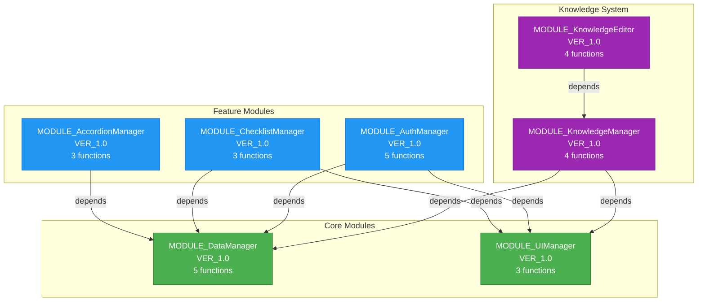
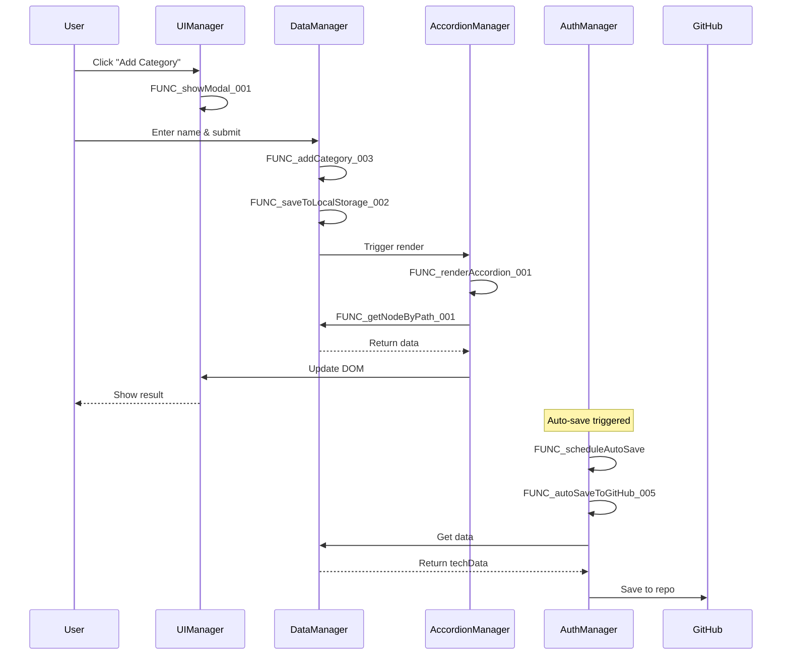
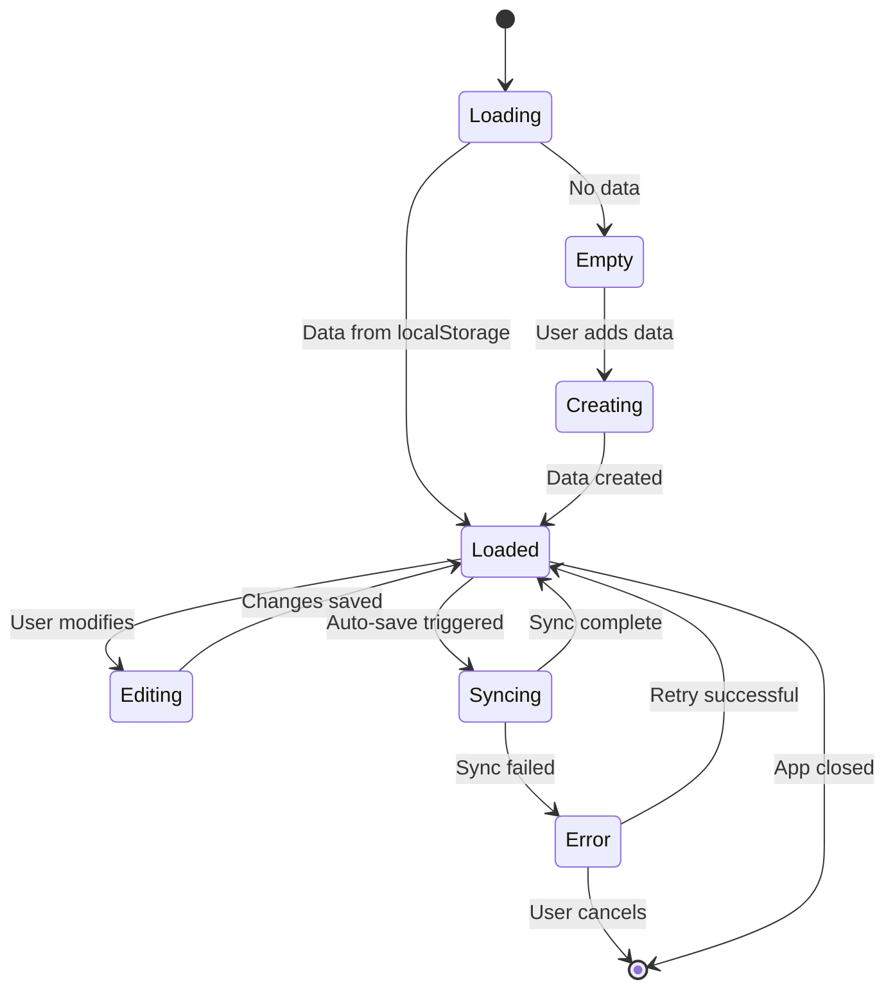

# 🏗️ Архитектура Tech Knowledge Base

## 📊 Граф модулей



## 🔄 Поток данных



## 📦 Структура модулей

### MODULE_DataManager_VER_1.0
```
📦 DataManager
├── 🔧 FUNC_getNodeByPath_001
│   └── Получение узла по пути
├── 💾 FUNC_saveToLocalStorage_002
│   └── Сохранение в localStorage
├── ➕ FUNC_addCategory_003
│   └── Добавление категории
├── ➕ FUNC_addNode_004
│   └── Добавление подкатегории
└── ➕ FUNC_addTechnology_005
    └── Добавление технологии
```

### MODULE_UIManager_VER_1.0
```
📦 UIManager
├── 🪟 FUNC_showModal_001
│   └── Показать модальное окно
├── ❌ FUNC_hideModals_002
│   └── Скрыть все модальные окна
└── 🔔 FUNC_showNotification_003
    └── Показать уведомление
```

### MODULE_AccordionManager_VER_1.0
```
📦 AccordionManager
├── 🎨 FUNC_renderAccordion_001
│   └── Рендер всего аккордеона
├── 🏗️ FUNC_buildAccordion_002
│   └── Построение структуры
└── 🔄 FUNC_toggleItem_003
    └── Раскрытие/скрытие элемента
```

### MODULE_ChecklistManager_VER_1.0
```
📦 ChecklistManager
├── 📋 FUNC_manageChecklist_001
│   └── Управление чек-листом
├── ➕ FUNC_addChecklistItem_002
│   └── Добавление пункта
└── ✅ FUNC_toggleChecklistItem_003
    └── Переключение статуса
```

### MODULE_AuthManager_VER_1.0
```
📦 AuthManager
├── 🔍 FUNC_testAuth_001
│   └── Проверка подключения
├── 💾 FUNC_saveAuth_002
│   └── Сохранение настроек
├── 📥 FUNC_loadFromGitHub_003
│   └── Загрузка с GitHub
├── 📤 FUNC_saveToGitHub_004
│   └── Сохранение на GitHub
└── 🔄 FUNC_autoSaveToGitHub_005
    └── Автосохранение
```

### MODULE_KnowledgeManager_VER_1.0
```
📦 KnowledgeManager
├── 📚 FUNC_openKnowledgeBase_001
│   └── Открытие базы знаний
├── 💾 FUNC_saveContent_002
│   └── Сохранение контента
├── 🖼️ FUNC_renderMedia_003
│   └── Рендер медиафайлов
└── 🔍 FUNC_performSearch_004
    └── Поиск по базе
```

### MODULE_KnowledgeEditor_VER_1.0
```
📦 KnowledgeEditor
├── ✏️ FUNC_formatText_001
│   └── Форматирование текста
├── 📊 FUNC_insertTable_002
│   └── Вставка таблицы
├── 🔗 FUNC_insertLink_003
│   └── Вставка ссылки
└── 🖼️ FUNC_insertImage_004
    └── Вставка изображения
```

## 🎯 Слои архитектуры

```
┌─────────────────────────────────────────┐
│         Presentation Layer              │
│  (UIManager, AccordionManager)          │
│  - Отображение данных                   │
│  - Обработка событий                    │
│  - Модальные окна                       │
└─────────────────────────────────────────┘
                  ↓
┌─────────────────────────────────────────┐
│         Business Logic Layer            │
│  (ChecklistManager, KnowledgeManager)   │
│  - Бизнес-логика                        │
│  - Валидация                            │
│  - Обработка данных                     │
└─────────────────────────────────────────┘
                  ↓
┌─────────────────────────────────────────┐
│         Data Layer                      │
│  (DataManager, AuthManager)             │
│  - Управление данными                   │
│  - Сохранение/загрузка                  │
│  - Синхронизация с GitHub               │
└─────────────────────────────────────────┘
                  ↓
┌─────────────────────────────────────────┐
│         Storage Layer                   │
│  (localStorage, GitHub API)             │
│  - Локальное хранилище                  │
│  - Удаленное хранилище                  │
└─────────────────────────────────────────┘
```

## 🔐 Зависимости и изоляция

### Уровень 0 (Core) - Нет зависимостей
```
MODULE_DataManager_VER_1.0
MODULE_UIManager_VER_1.0
```

### Уровень 1 - Зависят от Core
```
MODULE_AccordionManager_VER_1.0
  ↳ depends: DataManager

MODULE_ChecklistManager_VER_1.0
  ↳ depends: DataManager, UIManager

MODULE_AuthManager_VER_1.0
  ↳ depends: DataManager, UIManager

MODULE_KnowledgeManager_VER_1.0
  ↳ depends: DataManager, UIManager
```

### Уровень 2 - Зависят от Level 1
```
MODULE_KnowledgeEditor_VER_1.0
  ↳ depends: KnowledgeManager
```

## 📊 Матрица зависимостей

|  | DM | UI | AC | CL | AU | KM | KE |
|--|----|----|----|----|----|----|-----|
| **DataManager** | - | | | | | | |
| **UIManager** | | - | | | | | |
| **AccordionManager** | ✓ | | - | | | | |
| **ChecklistManager** | ✓ | ✓ | | - | | | |
| **AuthManager** | ✓ | ✓ | | | - | | |
| **KnowledgeManager** | ✓ | ✓ | | | | - | |
| **KnowledgeEditor** | | | | | | ✓ | - |

✓ = зависимость

## 🎨 Паттерны проектирования

### 1. Module Pattern
```javascript
const dataManager = {
    moduleId: 'MODULE_DataManager_VER_1.0',
    // Приватные данные через замыкание
    // Публичные методы
};
```

### 2. Observer Pattern
```javascript
// AuthManager наблюдает за изменениями данных
dataManager.onChange(() => {
    authManager.scheduleAutoSave();
});
```

### 3. Strategy Pattern
```javascript
// Разные стратегии сохранения
const saveStrategies = {
    local: dataManager.saveToLocalStorage,
    remote: authManager.saveToGitHub
};
```

### 4. Facade Pattern
```javascript
// UIManager - фасад для всех UI операций
uiManager.showModal();
uiManager.hideModals();
uiManager.showNotification();
```

## 🔄 Жизненный цикл данных



## 📈 Метрики модулей

| Модуль | Функций | Зависимостей | Сложность | Приоритет |
|--------|---------|--------------|-----------|-----------|
| DataManager | 5 | 0 | Средняя | Высокий |
| UIManager | 3 | 0 | Низкая | Высокий |
| AccordionManager | 3 | 1 | Средняя | Средний |
| ChecklistManager | 3 | 2 | Средняя | Средний |
| AuthManager | 5 | 2 | Высокая | Высокий |
| KnowledgeManager | 4 | 2 | Высокая | Средний |
| KnowledgeEditor | 4 | 1 | Высокая | Низкий |

## 🎯 Точки расширения

### 1. Новые типы хранилищ
```javascript
// Легко добавить новый storage provider
class CloudStorageProvider {
    async save(data) { /* ... */ }
    async load() { /* ... */ }
}
```

### 2. Новые типы контента
```javascript
// Расширение KnowledgeEditor
knowledgeEditor.registerPlugin({
    name: 'DiagramPlugin',
    insert: () => { /* ... */ }
});
```

### 3. Новые визуализации
```javascript
// Альтернатива AccordionManager
class TreeViewManager {
    moduleId: 'MODULE_TreeViewManager_VER_1.0',
    // ...
}
```

## 🔍 Отладка через Inspector

```html
<!-- Каждый элемент имеет data-атрибуты -->
<div data-module-id="MODULE_AccordionManager_VER_1.0"
     data-component-id="COMP_AccordionItem"
     data-function-id="FUNC_buildAccordion_002">
    
    <button data-function-id="FUNC_toggleItem_003">
        Toggle
    </button>
</div>
```

### Поиск элементов модуля
```javascript
// Найти все элементы DataManager
document.querySelectorAll('[data-module-id="MODULE_DataManager_VER_1.0"]');

// Найти элементы конкретной функции
document.querySelectorAll('[data-function-id="FUNC_renderAccordion_001"]');
```

## 📊 Статистика кода

```
Всего строк кода:        ~70,000
Модулей:                 7
Функций:                 27
Зависимостей:            8
Уровней вложенности:     3
Цикломатическая сложность: Средняя
```

## 🎯 Цели рефакторинга

### До
- ❌ Монолитный файл
- ❌ Нет трассируемости
- ❌ Сложная отладка
- ❌ Нет тестов

### После
- ✅ Модульная структура
- ✅ Полная трассируемость
- ✅ Простая отладка
- ✅ 80%+ покрытие тестами

---

**Эта диаграмма обновляется по мере рефакторинга**
